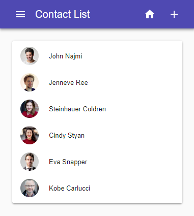

<h1 align="center">
   
</h1>

<h2>React + Material-UI + React-Router</h2>
The sample contact list application is built by
> React + Material-UI + React-Router

## The sameple application contains:

- UI: React-Material 
  * Style & Theme
  * AppBar & Drawer usage
  * Grid & Table usage
  * Paper & Textfield usage
- Navigation: React-router
  * Routing configuration
  * Route & Link usage